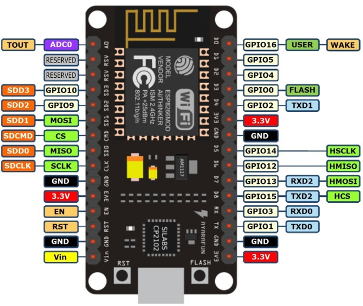

 # Deploy MicroPython scripts to ESP8226
 
 
 ## Control
 
 - Check if device is present. [This link](Flash_MicroPython_ESP8266.md) is describing connecting and flashing ESP8266.
 
 ## Connect
 
 - For connecting you can use [picocom](https://github.com/npat-efault/picocom) tool. So we have to install it.
 ```
 sudo apt-get install -y picocom
 ```
 - Type this command for connecting to ESP8266. Check your device tty path.
 ```
 picocom -b 115200 --flow n /dev/tty.SLAB_USBtoUART
 ```
 - After succesffully connecting you should see information header and python prompt `>>>`.  Now you can type MicroPython commands.
 
 Tip: For exit type `ctrl-a` and `ctrl-q`.
 
 ## Load scripts
 
 
 - For loading we will use [ampy](https://github.com/scientifichackers/ampy) tool. So we have to install it. On some Linux or Mac OSX systems you might need to install as root with sudo.
 ```
 pip install adafruit-ampy
 ```
 - For useful information you might type:
 ```
 ampy --help
 ```
 - After type `ampy -p /dev/tty.SLAB_USBtoUART ls` we can notice that in nodemcu is `boot.py` file. Nodemcu after connect power for first run this file and after run `main.py` (if is present).

- Now we can put some script to device.
```
ampy -p /dev/tty.SLAB_USBtoUART put main.py 
```
- If we want immediately run some script from ESP8266 with output we might type:
```
ampy -p /dev/tty.SLAB_USBtoUART run main.py 
```
Tip: My the best way for debugging scripts was loading script/s to device (without side effect running yourself) via `ampy`
and then connect to device via `picocom` and run code in MicroPython prompt etc. `import main`, `run_debug()`.
 
 
 
 ### Inspiration
 For created this manual I was inspirated by this page [https://naucse.python.cz/](https://naucse.python.cz/)
 
 
